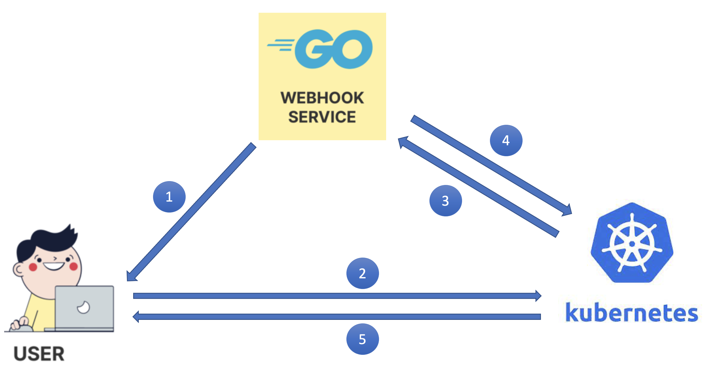

# Kubernetes authentication webhook using golang in minikube

Kubernetes authentication webhook can be used to delegate authentication outside of the Kubernetes. Please note that we are discussing about authentication webhook here, not authorization webhook.

[auth-webhook-sample](https://github.com/dinumathai/auth-webhook-sample) is a sample Kubernetes authentication webhook application. The code is structured to extend for further use cases like authentication against AD or some other open id provider like Azure AD.

## Prerequisites
1. Basic understanding of Kubernetes.
1. Minikube running in local machine.
1. Kubectl must be installed locally and must have a basic understanding of config for `kubectl`.
1. Docker Or Golang must be installed locally.

## How authentication webhook works


1. User generates token. In our case we will be using `auth-webhook-sample` application to generate token using the username/password. The token can be generated from different source for example if we use Azure AD, the token will be generated using Azure AD api.
1. User uses the token to call Kubernetes api by setting the token in the api header. In our case we will set the token in `kubectl` config and execute `kubectl get pods` command to call the Kubernetes api.
1. The token received by Kubernetes api will be passes to authentication webhook in [predefined format](https://kubernetes.io/docs/reference/access-authn-authz/authentication/#tokenreview-request-0)
1. The webhook validates the token a returns the `status` and `groups` for the user in [required format](https://kubernetes.io/docs/reference/access-authn-authz/authentication/#tokenreview-response-success-0)
1. Kubernetes will return response after validating the user permission to access the requested resource using the `groups` from webhook. The access can be configured using Kubernetes roles / clusterroles and Kubernetes rolebindings /clusterrolebindings. Read more at [Kubernetes RBAC Authorization
](https://kubernetes.io/docs/reference/access-authn-authz/rbac/).

## Create the certificate

The https://192.168.1.35:8443/ [deploy/ca/server.conf](deploy/ca/server.conf) must be modified and add your local system ip. And [deploy/ca/server.crt](deploy/ca/server.crt) must be regenerated using below commands.

```
openssl req -new -key server.key -out server.csr -config server.conf

# Sign the server certificate with the above CA
openssl x509 -req -in server.csr -CA ca.crt -CAkey ca.key -CAcreateserial -out server.crt -days 100000 -extensions v3_req -extfile server.conf
```
Commands to generate the all certificate files are available at [deploy/ca/README.md](deploy/ca/README.md).

## Docker & Run Build
The below docker is already uploaded to docker hub. So you can directly run the docker run command to bring up the authentication webhook.
```
git clone git@github.com/dinumathai/auth-webhook-sample.git
cd auth-webhook-sample
docker build -t dmathai/auth-webhook-sample:latest -f Dockerfile .

# GENERATE the server.crt and server.key
export AUTH_CERT_TLS_CRT=$(cat deploy/ca/server.crt)
export AUTH_CERT_TLS_KEY=$(cat deploy/ca/server.key)
docker run --env AUTH_CERT_TLS_KEY=$AUTH_CERT_TLS_KEY --env AUTH_CERT_TLS_CRT=$AUTH_CERT_TLS_CRT -p 8443:8443 dmathai/auth-webhook-sample:latest
```
The webhook application will at https://localhost:8443/.

## Building & Run Locally
If you want to run the application locally. Please follow below commands.
```
git clone git@github.com/dinumathai/auth-webhook-sample.git
cd auth-webhook-sample
go build github.com/dinumathai/auth-webhook-sample

# GENERATE the server.crt and server.key
export AUTH_CERT_TLS_CRT=$(cat deploy/ca/server.crt)
export AUTH_CERT_TLS_KEY=$(cat deploy/ca/server.key)
./auth-webhook-sample
```
The webhook application will at https://localhost:8443/.

## API Details

### Generate Auth JWT token
In this api the user credentials/details are manged by the auth service. Refer [config/user_details.yaml](config/user_details.yaml) to see the list of user and the groups configured for the users. The filepath of user details is configured in `v0.userDetailFilePath` of `config/user_details.yaml`. 

[Configuration file is explained here](doc/configuration.md)
```
curl -X POST http://localhost:8443/v0/login  -u __YOUR_USERNAME__:__YOUR_PASSWORD__
```

### Validate the Token
This URL will be used by Kubernetes to validate the token.
```
curl -X POST http://localhost:8443/v0/authenticate  -H 'Authorization: Bearer XXXXXXXXX'
```

```
curl -X POST http://localhost:8443/v0/authenticate -d '{
  "apiVersion": "authentication.k8s.io/v1beta1",
  "kind": "TokenReview",
  "spec": {
    "token": "XXXXXXX"
  }
}'
```

## Deploy in minikube
Assuming that the authentication webhook is running in https://192.168.1.35:8443/. If not you have to make sure [deploy/auth-webhook-conf.yaml](deploy/auth-webhook-conf.yaml) is changed. Also [deploy/ca/server.conf](deploy/ca/server.conf) is modified and [deploy/ca/server.crt](deploy/ca/server.crt) is regenerated.

1. Start minikube
1. Do `minikube ssh` and run `sudo su -` to become the root user.
1. Create a file `/var/lib/minikube/certs/auth/auth-webhook-conf.yaml` with below content from [deploy/auth-webhook-conf.yaml](deploy/auth-webhook-conf.yaml).
1. Put the `deploy/ca` folder inside `/var/lib/minikube/certs/auth/ca`.
1. Log out of minikube container.
1. Create roles and role binding using - `kubectl apply deploy/create-cluster-role-binding.yaml`. We are creating the cluster-role-binding for a groups `g_admin`. [g_admin](config/user_details.yaml). Read more at [Kubernetes RBAC Authorization
](https://kubernetes.io/docs/reference/access-authn-authz/rbac/)
1. Stop minikube.
1. Restart minikube with command `minikube start --driver=docker --extra-config apiserver.authentication-token-webhook-config-file=/var/lib/minikube/certs/auth/auth-webhook-conf.yaml`.

## Test authentication webhook
1. Generate the token using the curl `curl -X POST https://localhost:8443/v0/login  -u admin:admin --insecure`
1. Add new user to the `kubectl` config with token and change the context to user that new user. The config must look like this.
```
apiVersion: v1
clusters:
- cluster:
    certificate-authority: /Users/dinumathai/.minikube/ca.crt
    extensions:
    - extension:
        last-update: Sun, 05 Sep 2021 08:37:01 IST
        provider: minikube.sigs.k8s.io
        version: v1.22.0
      name: cluster_info
    server: https://127.0.0.1:49715
  name: minikube
contexts:
- context:
    cluster: minikube
    extensions:
    - extension:
        last-update: Sun, 05 Sep 2021 08:37:01 IST
        provider: minikube.sigs.k8s.io
        version: v1.22.0
      name: context_info
    namespace: default
    # Changed context to point to new admin user
    user: admin
  name: minikube
current-context: minikube
kind: Config
preferences: {}
users:
- name: admin
  user:
    token : XXXXXXXXXXXXXXXXXXXXXXXXXXXXXXXXXXXX
- name: minikube
  user:
    client-certificate: /Users/dinumathai/.minikube/profiles/minikube/client.crt
    client-key: /Users/dinumathai/.minikube/profiles/minikube/client.key
```
1. `kubectl get pods --all-namespaces` must return some pods and you must get some logs in webhook application. Done !!!

## References 

Also read [Kubernetes Webhook Token Authentication documentation](https://kubernetes.io/docs/reference/access-authn-authz/authentication/#webhook-token-authentication)
